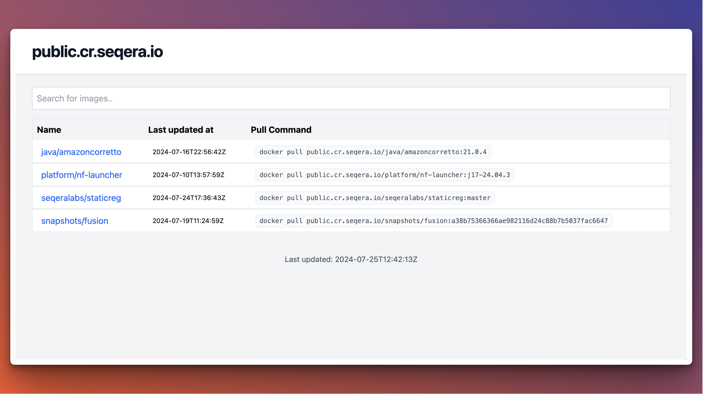

# :package: staticreg

A tool to serve a website from an OCI registry that supports the `/v2/_catalog` endpoint.

- [:package: staticreg](#package-staticreg)
  - [Features](#features)
  - [Install staticreg](#install-staticreg)
  - [Run staticreg](#run-staticreg)
    - [Serve the website](#serve-the-website)
    - [Run with Docker](#run-with-docker)
  - [Install on Kubernetes](#install-on-kubernetes)
  - [Contributing](#contributing)

## Features

:white_check_mark: Images list page<br>
:white_check_mark: Image tags list page<br>
:white_check_mark: Static website



## Install staticreg

If you need, you can run staticreg in your **Container runtime** or **Kubernetes cluster**, please see the sections below.

However, we also release pre-built binaries for Windows, Linux and MacOS for i386, x86_64 and arm64. Download them from [here](https://github.com/seqeralabs/staticreg/releases/latest).

## Run staticreg

### Serve the website

```bash
staticreg serve
```

### Run with Docker

```bash
docker run --rm -d cr.seqera.io/public/staticreg:0.1.4 serve --registry <registry-url-here>
```

## Install on Kubernetes

Create a secret with the registry details (the registry you want to list images for)

```bash
kubectl create secret generic registry-credentials \
  --from-literal=REGISTRY_USER=<username> \
  --from-literal=REGISTRY_PASSWORD=<password> \
  --from-literal=REGISTRY_HOSTNAME=<hostname>
```

Create the staticreg deployment

```
kubectl apply -f manifests/deployment.yml
```

## Contributing

See [CONTRIBUTING.md](CONTRIBUTING.md)
