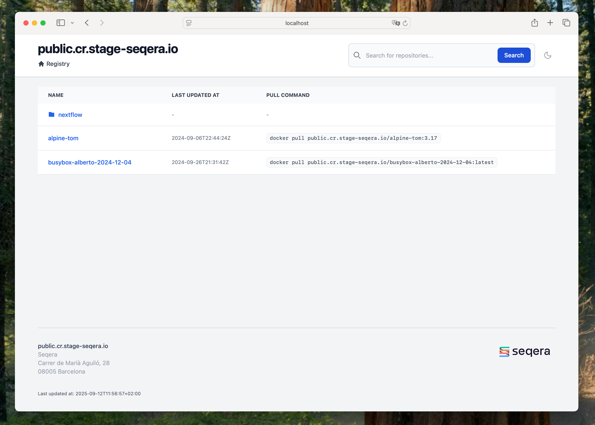

# :package: StaticReg

**Version 0.5.2**

A tool to serve a website from an OCI registry that supports the `/v2/_catalog` endpoint.

- [:package: staticreg](#package-staticreg)
  - [What is StaticReg?](#what-is-staticreg)
  - [How It Works](#how-it-works)
  - [Features](#features)
  - [Install staticreg](#install-staticreg)
  - [Run staticreg](#run-staticreg)
    - [Basic Usage](#basic-usage)
    - [Configuration Options](#configuration-options)
    - [Run with Docker](#run-with-docker)
  - [Install on Kubernetes](#install-on-kubernetes)
  - [FAQ](#faq)
  - [Troubleshooting](#troubleshooting)
  - [Contributing](#contributing)

## What is StaticReg?

StaticReg is a lightweight app that provides a web interface for browsing container images stored in OCI-compliant registries. It automatically discovers and displays all available images and their tags from any registry that supports the Docker Registry V2 API (`/v2/_catalog` endpoint).

**Use Cases:**
- Browse and explore container images in your public or private registry
- Provide a searchable catalog of available images to your team
- View image metadata and security scan information (via [Wave](https://seqera.io/wave/))
- Create a self-service portal for discovering container images

## How It Works

StaticReg operates by:

1. **Connecting to your OCI registry** using provided credentials (or anonymous access if supported)
2. **Fetching the catalog** of available images via the `/v2/_catalog` endpoint
3. **Retrieving tags** for each image asynchronously with rate limiting
4. **Caching results** to reduce load on the registry and improve performance
5. **Serving a web interface** that displays images, tags, and metadata
6. **Refreshing data** periodically to stay up-to-date with registry changes

The tool includes built-in rate limiting to prevent overwhelming the target registry and supports authentication for private registries.

## Features

- Images list page with search functionality
- Image tags list page with detailed information
- Static website served over HTTP
- Image security scan results (via Wave integration)
- Image manifest inspection (via Wave integration)
- Automatic caching and periodic refresh
- Rate-limited registry requests
- Support for authenticated registries
- TLS/SSL support
- Configurable refresh intervals



## Install staticreg

If you need, you can run staticreg in your **Container runtime** or **Kubernetes cluster**, please see the sections below.

However, we also release pre-built binaries for Windows, Linux and MacOS for i386, x86_64 and arm64. Download them from [here](https://github.com/seqeralabs/staticreg/releases/latest).

## Run staticreg

### Basic Usage

Start StaticReg with default settings (connects to `localhost:5000`):

```bash
staticreg serve
```

Connect to a specific registry:

```bash
staticreg serve --registry registry.example.com
```

With authentication:

```bash
staticreg serve \
  --registry registry.example.com \
  --user myusername \
  --password mypassword
```

Using environment variables:

```bash
export REGISTRY_HOSTNAME=registry.example.com
export REGISTRY_USER=myusername
export REGISTRY_PASSWORD=mypassword
staticreg serve
```

### Configuration Options

**Global Options:**
- `--registry <hostname>` - Registry hostname (default: `localhost:5000`, env: `REGISTRY_HOSTNAME`)
- `--user <username>` - Registry username for authentication (env: `REGISTRY_USER`)
- `--password <password>` - Registry password for authentication (env: `REGISTRY_PASSWORD`)
- `--wave-server-url <url>` - Wave server URL for security scanning (default: `https://wave.seqera.io`, env: `WAVE_SERVER_URL`)
- `--tls-enable` - Enable TLS for registry connections
- `--skip-tls-verify` - Skip TLS certificate verification (use with caution)
- `--json-logging` - Output logs in JSON format
- `--verbose` - Enable verbose logging

**Serve Command Options:**
- `--bind-addr <address>` - Server bind address (default: `127.0.0.1:8093`)
- `--cache-duration <duration>` - Cache duration for generated pages (default: `1m`, set to `0` to never expire)
- `--refresh-interval <duration>` - How often to refresh data from registry (default: `15m`)
- `--requests-per-second <rate>` - Rate limit for registry requests (default: `1`)
- `--ignored-user-agent <pattern>` - User agents to ignore (can be specified multiple times)

**Example with all options:**

```bash
staticreg serve \
  --registry registry.example.com \
  --user myuser \
  --password mypass \
  --bind-addr 0.0.0.0:8080 \
  --cache-duration 5m \
  --refresh-interval 30m \
  --requests-per-second 5 \
  --wave-server-url https://wave.seqera.io \
  --tls-enable \
  --verbose
```

### Run with Docker

```bash
docker run --rm -d \
  -p 8093:8093 \
  cr.seqera.io/public/staticreg:0.5.2 serve \
  --registry <registry-hostname> \
  --user <username> \
  --password <password> \
  --wave-server-url https://wave.seqera.io \
  --bind-addr 0.0.0.0:8093
```

## Install on Kubernetes

Create a secret with the registry details (the registry you want to list images for):

```bash
kubectl create secret generic registry-credentials \
  --from-literal=REGISTRY_USER=<username> \
  --from-literal=REGISTRY_PASSWORD=<password> \
  --from-literal=REGISTRY_HOSTNAME=<hostname>
```

Create the staticreg deployment:

```bash
kubectl apply -f manifests/deployment.yml
```

## FAQ

### Why it's named StaticReg?

Initially, this was a command line utility that generated a static website out of your registry. Well, did I say initially didn't I?!? Draw your conclusions!

### How to use with registries requiring authentication?

Authentication is required only if your registry doesn't allow anonymous read access. Public registries or registries configured for anonymous pulls don't require credentials.

### How does caching work?

StaticReg caches generated HTML pages for the duration specified by `--cache-duration` (default: 1 minute). This reduces load on your browser and server. The underlying registry data is refreshed according to `--refresh-interval` (default: 15 minutes).

### What is Wave integration?

[Wave](https://seqera.io/wave) is a container provisioning service by Seqera that provides enhanced container image capabilities including security scanning. When configured, StaticReg displays security scan results alongside image information.

### Can I customize the refresh rate?

Yes, use `--refresh-interval` to control how often StaticReg fetches fresh data from your registry. Use `--cache-duration` to control how long generated pages are cached. Balance these settings based on your registry's update frequency and load tolerance.

### What is rate limiting and why is it needed?

The `--requests-per-second` option limits how many requests StaticReg makes to your registry. This prevents overwhelming the registry when fetching data for many images. Increase this value for faster initial loading if your registry can handle higher request rates.

### Can I expose StaticReg publicly?

Yes, in fact, we do it!

- https://public.cr.seqera.io/
- https://community.wave.seqera.io/

### How do I use HTTPS?

StaticReg itself doesn't handle HTTPS termination. To serve over HTTPS:

- Use a reverse proxy (nginx, Caddy, Traefik) with TLS termination
- On Kubernetes, use an Ingress with TLS configuration

The `--tls-enable` flag is for connecting to registries over TLS, not for serving the web interface over HTTPS.

## Troubleshooting

### No images are displayed

**Symptoms:** The web interface loads but shows no images

**Solutions:**
- Verify images exist in the registry: `curl -u username:password https://<registry>/v2/_catalog`
- Check if the registry supports the `/v2/_catalog` endpoint (some registries disable it)
- Review StaticReg logs with `--verbose` flag for detailed error messages
- Wait for the initial refresh interval to complete (default: 15 minutes)
- Check if rate limiting is too aggressive: increase `--requests-per-second`
- Remember that HTML responses are cached as well, try to pass `--cache-duration 1s` :)

## Contributing

See [CONTRIBUTING.md](CONTRIBUTING.md)
